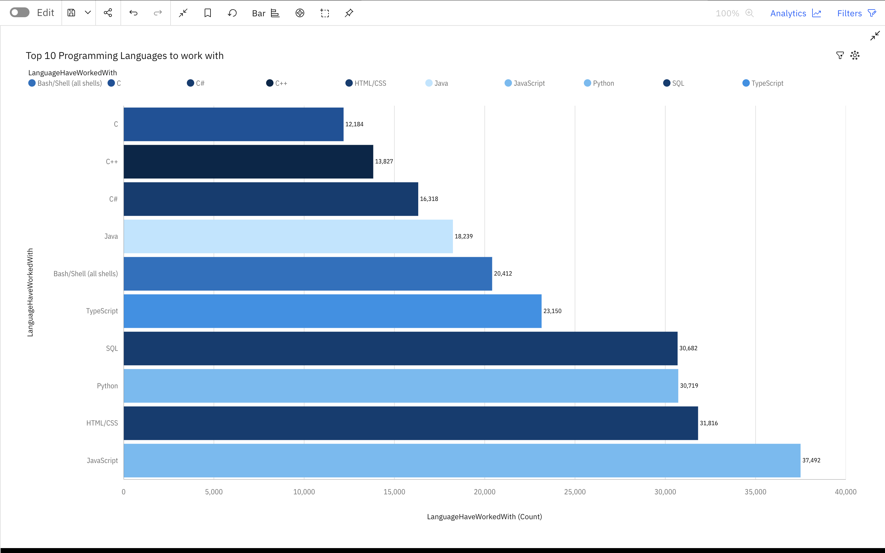
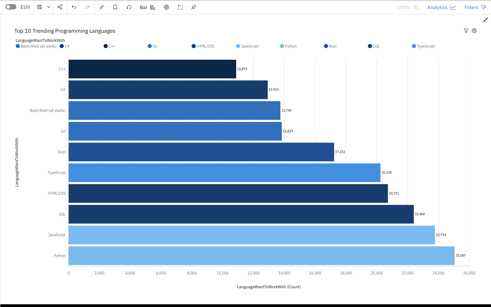
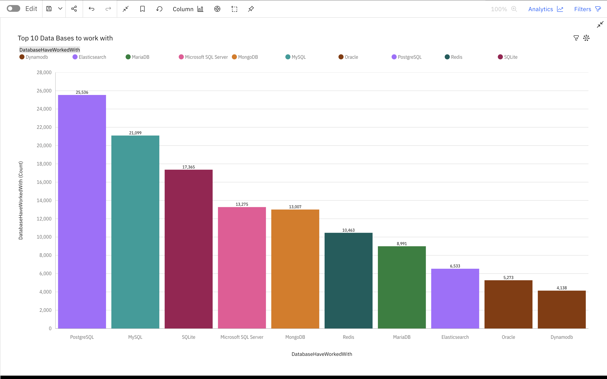
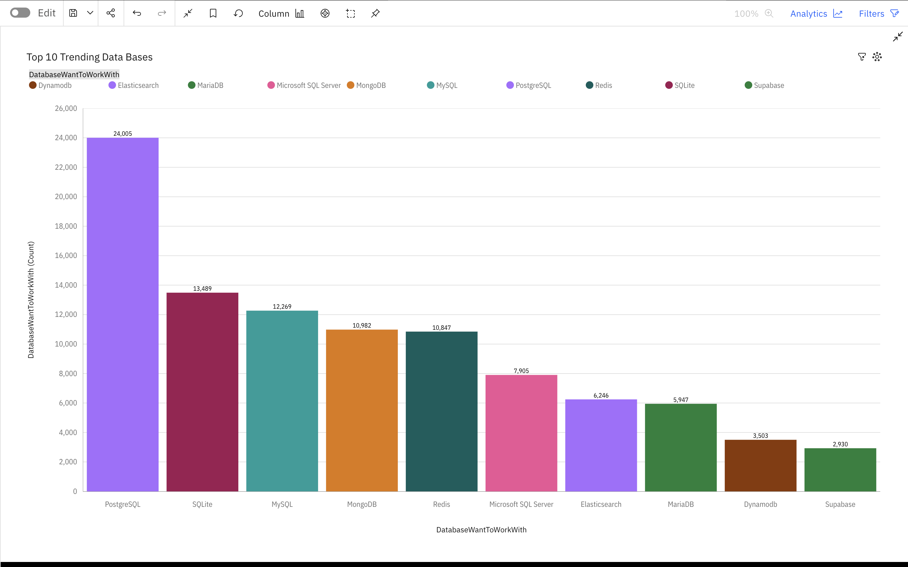
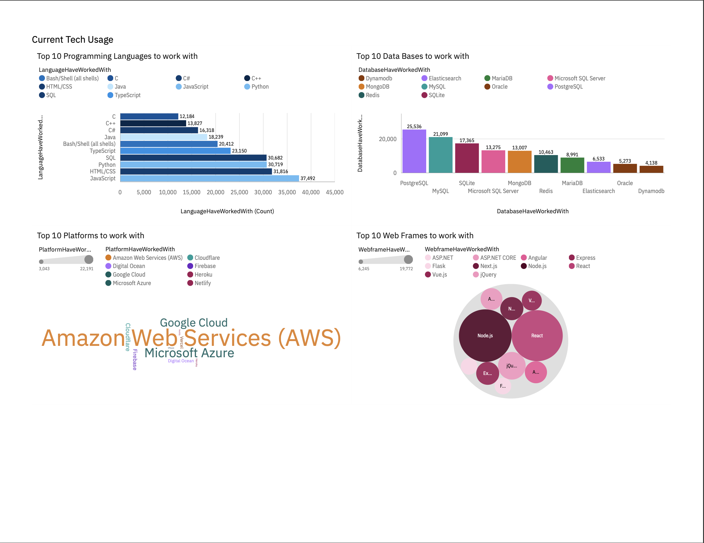
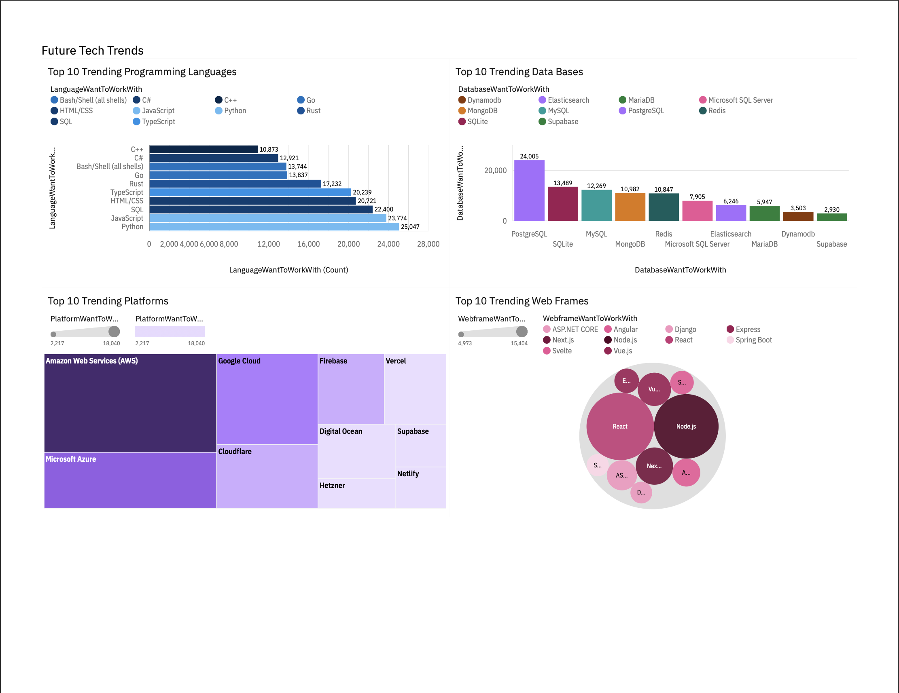
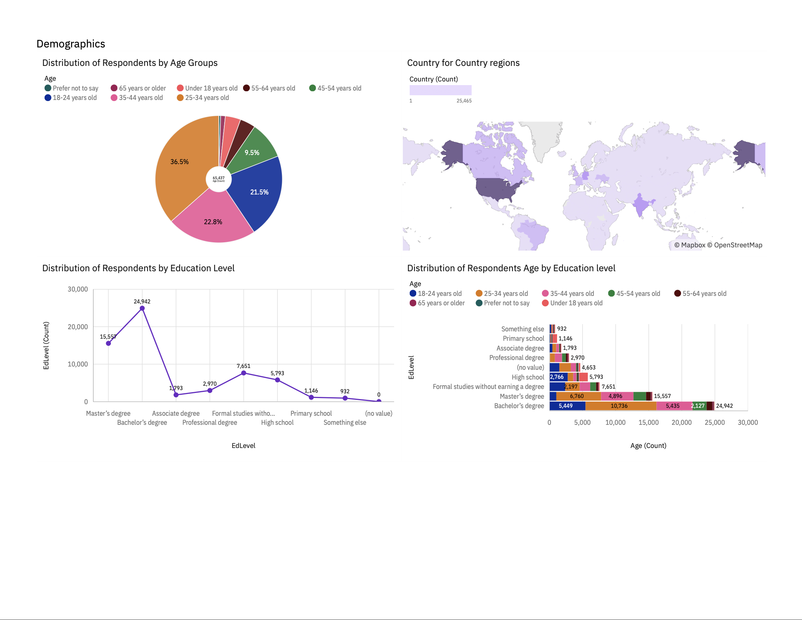

# Tech_Trends_Analysis

---

## Table of Contents

* [Project Overview](#project-overview)
* [Data Source](#data-source)
* [Tools Used](#tools-used)
* [Insights](#insights)

  * [Programming Language Trends](#programming-language-trends)
  * [Databases](#databases)
  * [Platforms](#platforms)
  * [Web Frameworks](#web-frameworks)
* [Dashboard](#dashboard)

---

## Project Overview

This project analyzes the Stack Overflow Developer Survey to identify current and future technology trends in the software development industry.

The goal of this analysis is to explore how developer preferences are evolving across programming languages, databases, platforms, and web frameworks, and to highlight technologies that are likely to grow in demand.

The final insights are presented through visualizations and an interactive dashboard built using IBM Cognos Analytics.

## Data Source

The dataset used in this project comes from the Stack Overflow Developer Survey. The survey collects responses from developers around the world about their tools, technologies, and professional experiences.

It provides insights into:

* Programming languages developers use and want to learn
* Databases and platforms currently in use
* Technologies developers plan to adopt in the future
* Developer demographics

## Tools Used

* Python
* Pandas
* Jupyter Notebook
* IBM Cognos Analytics
* Data Visualization
* GitHub

## Insights

### Programming Language Trends

Python has overtaken JavaScript as the most desired programming language developers want to work with, while the overall top five languages remain largely consistent.

  
  

### Databases

PostgreSQL, MySQL and SQLite remain the most commonly used databases among respondents, and they also appear as the top technologies developers plan to continue using in the future.

  
  

### Platforms

Cloud computing platforms dominate the development landscape. Amazon Web Services (AWS) leads the market, followed by Microsoft Azure and Google Cloud, indicating strong industry adoption of cloud infrastructure.

  
  

### Web Frameworks

React and Node.js dominate the web framework ecosystem. Their popularity remains strong both for current usage and future adoption among developers.

  
  

## Dashboard

This dashboard was created using IBM Cognos Analytics to provide an interactive view of the technology trends identified in the dataset.

### Current Technology Usage

  

### Future Technology Trends

  

### Respondents Demographics

# Insights:
The main target audience for any sales manager would be **18-44 years old** that live in **western societies, mainly the USA.**
As this age group takes up **80.8% of the total developers.** Based on the developers of this survey.

This insight can be useful to many businesses, from the Tech companies that create these tools, to a beginner wanting to understand where and how to start their data journey. 

**Who else can benefit from these findings:**
* Companies creating tools and copilots.
* Marketing Teams
* Sales Teams
* HR Teams
* Educational organizations; Universities, Coding courses, Self-studying students ect.

  

